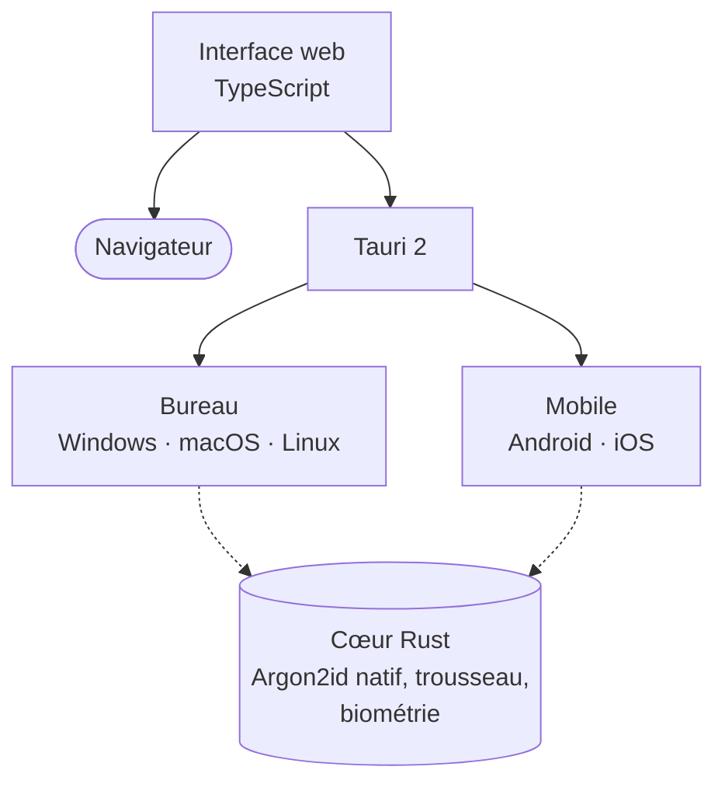
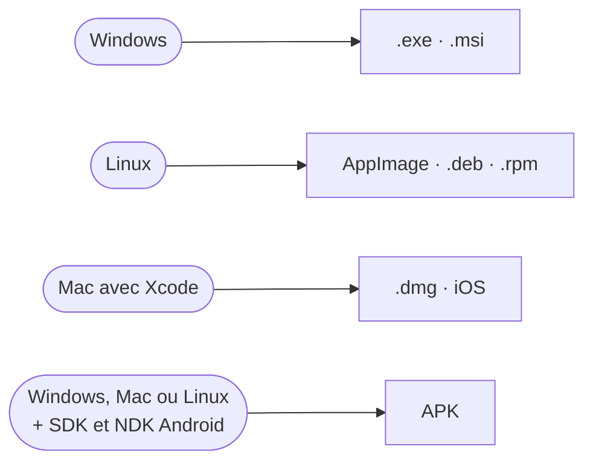

# Applications de bureau et mobile

Une seule interface, celle du site, dans toutes les applications. [Tauri 2](https://v2.tauri.app) l'emballe avec un cœur Rust, qui apporte ce qu'un navigateur ne sait pas faire.

:::mermaid[Une interface, un cœur Rust par plateforme]

:::

## Ce qui existe par plateforme

:::table{style="striped"}
| Plateforme | État | Installation | Déverrouillage rapide | Remplissage |
| --- | --- | --- | --- | --- |
| Navigateur | :badge[Disponible] | Aucune, ou « Installer l'application » | Mot de passe principal | Extension de navigateur |
| Windows | :badge[Testé] | Installeur `.exe` ou `.msi` | Windows Hello | Extension de navigateur |
| Linux | :badge[Testé] | AppImage, `.deb`, `.rpm` | Trousseau de session | Extension de navigateur |
| Android | :badge[Testé] | APK | Empreinte ou visage | Service de remplissage Android |
| macOS | :badge[Code prêt] | `.dmg` | Touch ID | Extension de navigateur |
| iOS, iPadOS | :badge[Code prêt] | Xcode, TestFlight | Face ID ou Touch ID | Extension de mots de passe iOS |
:::

**Testé** : essayé sur l'appareil. **Code prêt** : dans le dépôt, pas encore essayé sur l'appareil. Ce qui est réellement publié se voit sur la page **Télécharger** de votre serveur (`/download`).

:::tip[Sur téléphone, sans rien construire]
La version web s'installe comme une application : **Chrome sur Android** propose « Installer l'application », **Safari sur iOS** « Sur l'écran d'accueil ». Elle s'ouvre sans barre d'adresse, fonctionne hors ligne et se met à jour avec le serveur. Les applications natives ajoutent surtout le remplissage automatique du système et le déverrouillage biométrique.
:::

### Construire sur la bonne machine

Chaque système se construit chez lui : Tauri ne fabrique pas un `.dmg` depuis Windows.

:::mermaid[Quelle machine construit quoi]

:::

Étape par étape : [Construire pas à pas](../development/build-guide.md). Pour les fichiers Apple : [macOS et iOS](apple.md).

## Bureau (Windows, macOS, Linux)

### Prérequis

- Node.js 24
- [Rust](https://rustup.rs)
- Dépendances système Tauri : [liste par plateforme](https://v2.tauri.app/start/prerequisites/)

### Lancer en développement

```bash
npm install
```

```bash
npm run tauri dev
```

### Construire les installeurs

```bash
npm run tauri build
```

Les installeurs sont générés dans `src-tauri/target/release/bundle/` (`.msi` / `.exe` sous Windows, `.dmg` sous macOS, `.deb` / `.AppImage` sous Linux).

### Spécificités

- Argon2id est calculé en Rust natif.
- Les exports sont enregistrés dans le dossier **Téléchargements**.
- Adresse de serveur par défaut : `http://127.0.0.1:8787`.
- **Windows et macOS** : le déverrouillage rapide s'appuie sur Windows Hello ou Touch ID, et la clé du coffre est rangée dans le trousseau du système.
- **Linux** : pas de biométrie reliée. L'ouverture rapide existe quand même, portée par le trousseau de session (GNOME Keyring, KWallet) : le coffre s'ouvre sans retaper le mot de passe, mais une fois votre session ouverte, rien de plus n'est demandé. L'interface le dit noir sur blanc au moment de l'activer ; si cela ne vous convient pas, laissez l'option désactivée et le mot de passe principal sera demandé à chaque fois.
- **macOS** : une application distribuée hors App Store doit être signée et notariée, sinon Gatekeeper la bloque au premier lancement.

## Mobile (Android, iOS)

### Prérequis

=== "Android"

    - Android Studio avec SDK et NDK
    - Variables `ANDROID_HOME` et `NDK_HOME`
    - Cibles Rust :

    ```bash
    rustup target add aarch64-linux-android armv7-linux-androideabi i686-linux-android x86_64-linux-android
    ```

=== "iOS (macOS uniquement)"

    - Xcode
    - Cibles Rust :

    ```bash
    rustup target add aarch64-apple-ios x86_64-apple-ios aarch64-apple-ios-sim
    ```

### Initialiser le projet natif

```bash
npm run tauri android init
```

```bash
npm run tauri ios init
```

### Lancer

```bash
npm run tauri android dev
```

```bash
npm run tauri ios dev
```

### Construire

```bash
npm run tauri android build
```

```bash
npm run tauri ios build
```

!!! warning "Windows : « Unable to establish loopback connection »"
    Si Gradle échoue avec ce message, Java n'arrive pas à créer ses sockets locales dans le dossier temporaire. Utilisez un dossier simple :

    ```powershell
    New-Item -ItemType Directory -Force C:\gradle-tmp
    $env:TEMP='C:\gradle-tmp'; $env:TMP='C:\gradle-tmp'
    $env:JAVA_TOOL_OPTIONS='-Djdk.net.unixdomain.tmpdir=C:\gradle-tmp'
    npm run tauri android build -- --apk --target aarch64
    ```

    L'APK est créé dans `src-tauri/gen/android/app/build/outputs/apk/universal/release/`. Il n'est pas signé : signez-le avec `apksigner` (ou configurez une clé dans Android Studio) avant de l'installer.

### Au lancement

- L'application ouvre un écran de lancement à sa marque (logo, nom, barre de progression) plutôt qu'une page blanche, puis s'efface dès que le coffre ou l'écran de connexion est prêt.
- Le fond de la fenêtre Android est peint aux couleurs de l'application avant même la page : plus de flash blanc.
- Ses styles vivent dans `public/splash.css` : la politique de sécurité de contenu refuse le style écrit en clair dans la page.

### Interface sur téléphone

- La navigation passe dans une barre en bas de l'écran : identifiants, codes 2FA, bouton d'ajout, tâches, menu.
- Les fiches s'ouvrent en plein écran ; les fenêtres deviennent des panneaux glissant du bas, dont les boutons restent au pouce.
- Les marges tiennent compte de l'encoche et de la barre de gestes (`safe-area`), en portrait comme en paysage.
- Tout ce qui se touche fait au moins 44 px, et les champs s'affichent en 16 px pour que le navigateur n'agrandisse pas la page au moment de la saisie.
- « Tirer pour rafraîchir » est désactivé : un rechargement reverrouillerait le coffre.

### Spécificités

- Le scan des QR codes 2FA utilise la caméra : Android demande l'autorisation au premier scan. Sur iOS, ajoutez `NSCameraUsageDescription` dans `src-tauri/gen/apple/bettervault_iOS/Info.plist` après `tauri ios init`.
- Les exports sont enregistrés dans le dossier Documents de l'application.
- Le trousseau du système est utilisé des deux côtés : Keychain sur iOS, Android Keystore sur Android (une paire de clés y vit, et la lecture du secret demande l'empreinte ou le visage).
- Le remplissage automatique du système est en place sur les deux : service de remplissage Android (`BetterVaultAutofillService`) et extension de mots de passe iOS. Sur iOS, l'extension se branche dans Xcode après `tauri ios init` (voir l'en-tête du fichier Swift).
- Un serveur accessible en HTTPS est nécessaire : `127.0.0.1` désigne le téléphone lui-même.
