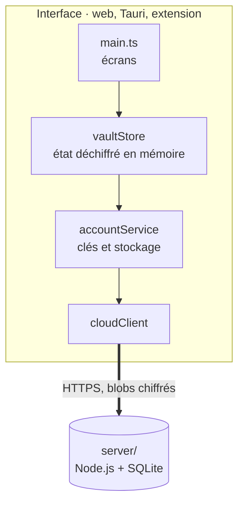
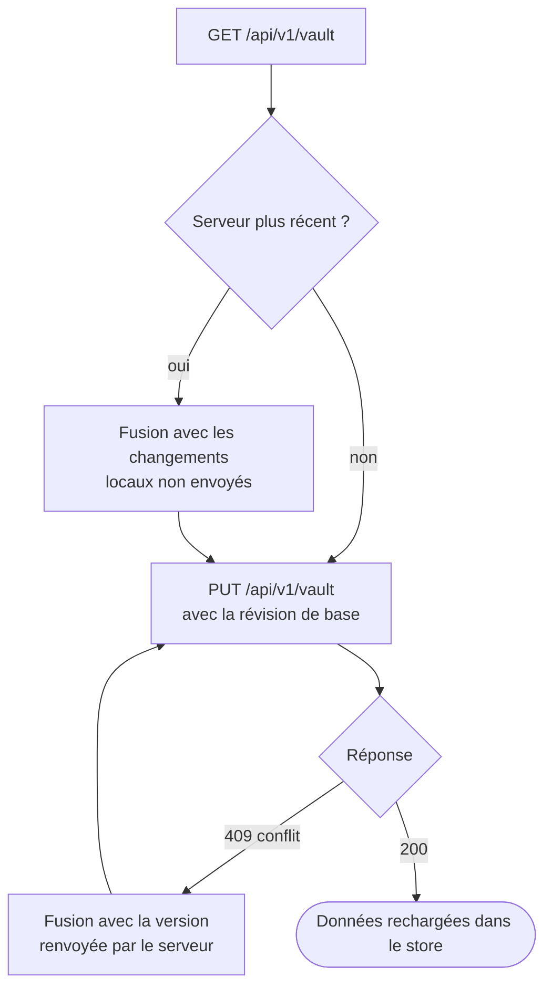

# Architecture

## Vue d'ensemble

:::mermaid[Tout se déchiffre dans l'interface ; le serveur ne garde que du chiffré]

:::

## Dossiers

| Dossier | Contenu |
| --- | --- |
| `src/account/` | Compte : dérivation des clés, service de compte, client HTTP, fusion des versions |
| `src/store/` | `VaultStore` : état du coffre déchiffré, coffres, identifiants, tâches, tags |
| `src/tasks/` | Règles des tâches : Eisenhower, récurrences, dépendances, rappels |
| `src/crypto/` | Entropie, générateurs, liste EFF, TOTP, QR code, Have I Been Pwned |
| `src/import_export/` | KeePass, 1Password, Bitwarden, CXF, CSV, exports chiffrés |
| `src/ui/` | Écran de compte, saisie de tags |
| `src/extension/` | Popup et fonction de remplissage |
| `src/platform/` | Pont vers Tauri (Argon2id natif, fichiers, trousseau) |
| `server/` | API de synchronisation |
| `src-tauri/` | Cœur Rust et configuration Tauri |
| `extension/` | Manifeste et page du popup |
| `tests/` | Tests Vitest, dont serveur réel et synchronisation multi-appareils |

## Flux de données

### Déverrouillage

:::steps
:::step[Dériver les clés]
`accountService.unlock(motDePasse)` dérive les clés et déchiffre la clé du coffre.
:::
:::step[Déchiffrer]
Le coffre chiffré local est déchiffré.
:::
:::step[Charger]
`vaultStore.load(données)` charge l'état ; l'interface s'affiche.
:::
:::step[Brancher l'enregistrement]
`vaultStore.setPersistence(...)` : chaque modification appelle `accountService.save`.
:::
:::

### Modification

:::steps
:::step[Action]
L'interface appelle une méthode du store (`addCredential`, `updateTag`…).
:::
:::step[Mise à jour]
Le store date l'élément (`updatedAt`) et notifie l'interface.
:::
:::step[Enregistrement]
`accountService.save` chiffre et écrit localement, puis programme une synchronisation 1,5 s plus tard.
:::
:::

### Synchronisation

:::mermaid[Une synchronisation, conflit compris]

:::

### Fusion

`mergeVaultData` combine deux versions élément par élément (coffres, identifiants, tâches, tags) : la version avec le `updatedAt` le plus récent est gardée. Les suppressions sont enregistrées dans `deleted` (identifiant → date) et l'emportent sur les modifications antérieures.

## Format des données

`UnlockedVaultData` (défini dans `src/types/vault.ts`) :

```ts
interface UnlockedVaultData {
  vaults: VaultMetadata[];
  activeVaultId: string;
  credentials: CredentialItem[];
  tasks: Task[];
  tagDefs: TagDef[];
  folders: FolderDef[];
  vaultTypes?: VaultTypeDef[];
  deleted: Record<string, number>;
}
```

Chaque `CredentialItem` porte un `type` (`login`, `note`, `card`, `identity`, `sshKey`, `file`, `folder`)
et range les champs propres à ce type dans sa propre clé (`card`, `identity`, `sshKey`). Un élément
**sans type enregistré est un identifiant** : les coffres créés avant les types se lisent tels quels.

Les `FolderDef` rangent les éléments en arborescence à l'intérieur d'un coffre : un dossier a un
`vaultId`, un `parentId` facultatif, et un élément pointe vers son dossier par `folderId`.

Les anciennes données sont migrées par `normalizeVaultData` au chargement, qui répare aussi les
dossiers orphelins et les boucles de parents.

## Dossiers du dépôt

Le tableau plus haut liste les dossiers de sources. Voir [Choix techniques](technical.md) pour le
raisonnement derrière ces découpages, et [Construire l'application](build.md) pour produire chaque paquet.
