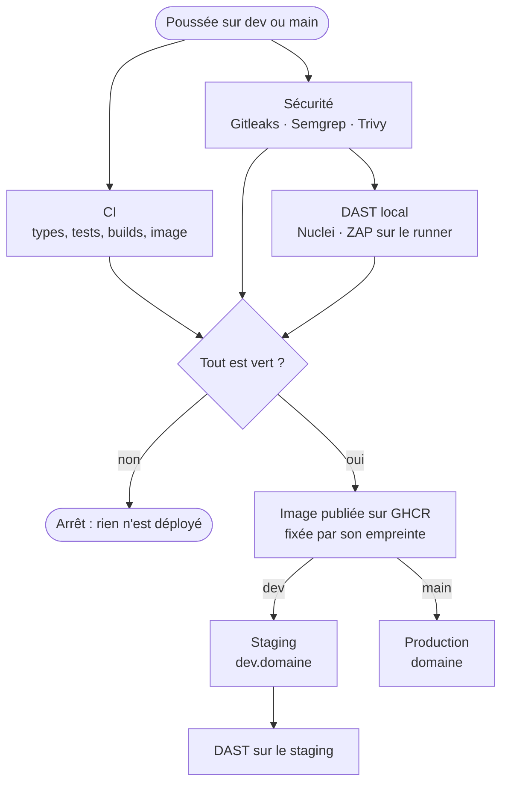
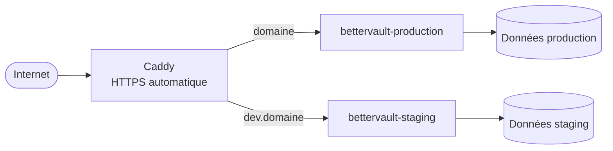

# Intégration et déploiement continus

Tout passe par GitHub Actions. Une demande de fusion est testée et scannée ; une poussée sur `dev` part sur le **staging**, une poussée sur `main` part en **production**, et rien n'est déployé si les tests ou la porte de sécurité échouent.

:::mermaid[D'une poussée à une instance en ligne]

:::

## Les workflows

:::table{style="striped"}
| Fichier | Quand | Rôle |
| --- | --- | --- |
| `ci.yml` | Demande de fusion, appelé par Deploy | Types, tests, builds web et extension, doc, image Docker démarrée, application de bureau |
| `security.yml` | Demande de fusion, appelé par Deploy, chaque lundi | Secrets, code, dépendances, image, DAST local, porte de sécurité |
| `dast.yml` | Appelé (local ou staging), ou à la main | Nuclei et ZAP contre une instance qui tourne |
| `deploy.yml` | Poussée sur `main` ou `dev` | CI + sécurité, puis image, puis déploiement sur le VPS |
| `release.yml` | Tag `v*` | Versions publiées (voir [Publier une version](releasing.md)) |
| `docs.yml` | Poussée sur `main` touchant `docs/` | Site de doc sur GitHub Pages, s'il est activé |
:::

## Tests de sécurité

Aucun de ces outils n'utilise d'IA ; tous tournent dans des images Docker **fixées par version et par empreinte** (en tête de `security.yml` et `dast.yml`).

:::table{style="striped"}
| Contrôle | Outil | Ce qui est analysé |
| --- | --- | --- |
| Secrets | Gitleaks | Les commits de la poussée ou de la demande de fusion, et les fichiers actuels. Chaque lundi, tout l'historique (rapport seul). |
| Code (SAST) | Semgrep | TypeScript, JavaScript, Dockerfile et workflows, avec les jeux de règles de `SEMGREP_RULES` |
| Dépendances | Trivy (fichiers) | `package-lock.json`, `Cargo.lock`, et la configuration (Dockerfile) |
| Image | Trivy (image) | L'image Docker construite depuis le commit |
| DAST | Nuclei, OWASP ZAP | Une instance lancée **dans le runner** ; après un déploiement sur `dev`, le staging |
:::

Les deux scanners dynamiques sont **non destructifs** : ZAP tourne en mode *baseline* (exploration et analyse passive, requêtes GET), Nuclei sans les modèles `dos`, `fuzz`, `intrusive`, `bruteforce`, `rce` ni `sqli`, à 10 requêtes par seconde au plus.

### La porte de sécurité

Chaque scanner dépose un rapport JSON ; `scripts/security-gate.mjs` les lit, écrit un tableau dans le résumé du job, et décide.

:::table{style="striped"}
| Sévérité | Par défaut | Réglage |
| --- | --- | --- |
| CRITICAL, HIGH | Bloque | `SECURITY_BLOCK_LEVEL=critical` pour ne bloquer que sur CRITICAL |
| MEDIUM | Signalé | `SECURITY_BLOCK_LEVEL=medium` pour bloquer aussi |
| LOW, INFO | Signalé | Ne bloque jamais |
| Secret trouvé | Bloque | `SECURITY_BLOCK_SECRETS=false` (déconseillé) |
| Vulnérabilité sans correctif publié | Signalée | `SECURITY_BLOCK_UNFIXED=true` pour bloquer aussi |
:::

Un rapport **absent** fait échouer la porte : un scanner qui n'a pas tourné n'est jamais compté comme « rien trouvé ».

Les seuils se règlent dans **GitHub → Settings → Secrets and variables → Actions → Variables** :

- `SECURITY_BLOCK_LEVEL` : `critical`, `high` (défaut), `medium` ou `none` (rapport seul) ;
- par outil, pour ajuster un seul scanner : `SECURITY_BLOCK_LEVEL_SAST`, `_DEPS`, `_IMAGE`, `_NUCLEI`, `_ZAP` ;
- `SECURITY_BLOCK_SECRETS`, `SECURITY_BLOCK_UNFIXED` comme ci-dessus.

### Où voir les résultats

Un constat **signalé** apparaît partout, mais ne fait pas échouer le pipeline ; un constat **bloquant** fait en plus échouer le job.

:::table{style="striped"}
| Où | Ce qu'on y trouve |
| --- | --- |
| **Commentaire sur la PR** | Le tableau de chaque porte (statique, DAST), les constats bloquants, et les signalés dans une section repliable. Un seul commentaire par porte, mis à jour à chaque passage. |
| **Security → Code scanning** | Les constats de Semgrep et Trivy (fichiers et image), en alertes suivies dans le temps (ouvertes, corrigées, écartées), annotées sur les lignes modifiées des PR |
| **Résumé du run** (Actions → run → *Summary*) | Les mêmes tableaux que le commentaire, pour les poussées et les lancements planifiés |
| **Artefacts** (`rapport-*`, `rapports-dast-*`) | Les rapports complets : JSON, SARIF, `zap.html` lisible dans un navigateur ; gardés 30 jours |
:::

Le commentaire et l'envoi à Code scanning sont faits pour les PR du dépôt lui-même ; pour une PR venue d'un fork, GitHub ne donne pas les droits d'écriture, et seuls le résumé et les artefacts restent. Une alerte de Code scanning se ferme d'elle-même quand le constat disparaît, ou s'écarte à la main (*Dismiss*) avec une raison.

### Accepter ou exclure un constat

Chaque exception s'écrit dans un fichier suivi par Git, avec sa raison :

:::table{style="striped"}
| Outil | Fichier | Format |
| --- | --- | --- |
| Gitleaks | `.gitleaksignore` | Empreinte du constat (colonne *Fingerprint* du rapport) |
| Semgrep | `.semgrepignore` | Chemins exclus ; ou `// nosemgrep: <règle>` sur la ligne, avec un commentaire |
| Trivy | `.trivyignore` | Identifiant CVE, raison et date de réexamen |
| ZAP | `security/zap-rules.tsv` | `identifiant<TAB>IGNORE<TAB>raison` |
:::

:::warning[Un secret trouvé se révoque]
Ignorer un secret ne le rend pas inoffensif. Révoquez-le d'abord chez son fournisseur, puis ajoutez son empreinte à `.gitleaksignore` pour que l'historique cesse de le signaler.
:::

### Cibles du DAST

- **Chemins** visés par Nuclei : `security/dast-paths.txt`, une ligne par chemin. Pour ajouter une cible, ajoutez son chemin ; pour l'exclure, retirez-le ou commentez-le. N'y mettez jamais une route qui modifie des données.
- **Hôtes** autorisés hors du runner : la variable `SECURITY_DAST_ALLOWED_HOSTS` (ex. `dev.vault.exemple.fr`). Une adresse absente de cette liste est refusée, et l'hôte de `PRODUCTION_URL` est **toujours** refusé, même s'il y figure.

### Lancer les scans à la main

**Sur GitHub** : **Actions → Sécurité → Run workflow**, ou **Actions → DAST → Run workflow** avec la cible `local` ou `staging`.

**Sur votre machine**, avec Docker, depuis la racine du dépôt :

=== "Secrets et code"

    ```bash
    mkdir -p reports
    docker run --rm -v "$PWD:/repo" -w /repo zricethezav/gitleaks:v8.30.1 dir --redact --report-format json --report-path reports/gitleaks-dir.json /repo
    docker run --rm -v "$PWD:/src" -w /src semgrep/semgrep:1.177.0 semgrep scan --config p/typescript --config p/nodejs --metrics=off --json --output reports/semgrep.json
    node scripts/security-gate.mjs reports secrets sast
    ```

=== "Dépendances et image"

    ```bash
    mkdir -p reports
    docker build -t bettervault:scan .
    docker run --rm -v "$PWD:/src" -w /src aquasec/trivy:0.74.0 fs --scanners vuln,misconfig --format json --output reports/trivy-fs.json .
    docker run --rm -v /var/run/docker.sock:/var/run/docker.sock -v "$PWD:/src" -w /src aquasec/trivy:0.74.0 image --format json --output reports/trivy-image.json bettervault:scan
    node scripts/security-gate.mjs reports deps image
    ```

=== "DAST (instance locale)"

    ```bash
    mkdir -p reports && chmod 777 reports
    docker run -d --name bv -p 127.0.0.1:8787:8787 -e BETTERVAULT_SECRET="$(openssl rand -base64 48)" bettervault:scan
    grep -vE '^\s*(#|$)' security/dast-paths.txt | sed 's#^#http://127.0.0.1:8787#' > reports/targets.txt
    docker run --rm --network host -v "$PWD/reports:/reports" projectdiscovery/nuclei:v3.11.1 -l /reports/targets.txt -tags exposure,misconfig,cve -exclude-tags dos,fuzz,intrusive -rate-limit 10 -jsonl -o /reports/nuclei.jsonl
    docker run --rm --network host -v "$PWD/reports:/zap/wrk:rw" zaproxy/zap-stable:2.17.0 zap-baseline.py -t http://127.0.0.1:8787 -I -J zap.json -r zap.html
    node scripts/security-gate.mjs reports nuclei zap
    ```

Sous Windows, lancez ces commandes dans Git Bash ou WSL. `--network host` demande Docker sous Linux ou WSL 2.

## Déploiement sur le VPS

:::mermaid[Un VPS, deux instances derrière un seul proxy]

:::

La production et le staging sont deux instances séparées : chacune a son `.env`, ses secrets, sa base et ses comptes. Rien ne passe de l'une à l'autre.

### 1. Préparer le VPS (une fois)

:::steps
:::step[Docker]
Installer Docker Engine et le plugin Compose, puis créer un utilisateur de déploiement membre du groupe `docker` :

```bash
sudo adduser --disabled-password deploy && sudo usermod -aG docker deploy
```
:::
:::step[Clé SSH dédiée]
Sur votre machine, créer une clé réservée au déploiement, et autoriser sa partie publique pour l'utilisateur `deploy` :

```bash
ssh-keygen -t ed25519 -f bettervault-deploy -C "github-actions deploy" -N ""
ssh-copy-id -i bettervault-deploy.pub deploy@VOTRE_VPS
```
:::
:::step[DNS]
Faire pointer `vault.exemple.fr` et `dev.vault.exemple.fr` (enregistrements A/AAAA) vers le VPS. Avec Cloudflare, laisser le proxy désactivé le temps que Caddy obtienne ses certificats.
:::
:::step[Dossiers et secrets]
Créer les dossiers et un `.env` par environnement, à partir de `deploy/vps/env.example` (valeurs différentes pour chacun) :

```bash
sudo mkdir -p /opt/bettervault/production /opt/bettervault/staging /opt/bettervault/proxy
sudo chown -R deploy: /opt/bettervault
nano /opt/bettervault/production/.env && chmod 600 /opt/bettervault/production/.env
nano /opt/bettervault/staging/.env && chmod 600 /opt/bettervault/staging/.env
```
:::
:::step[Proxy HTTPS]
Copier `deploy/vps/proxy/` dans `/opt/bettervault/proxy/`, y écrire `PROD_DOMAIN=vault.exemple.fr` dans un `.env`, puis :

```bash
docker network create bettervault-web
docker compose -f /opt/bettervault/proxy/compose.yaml up -d
```
:::
:::

### 2. Configurer GitHub

Dans **Settings → Environments**, créer deux environnements, `staging` et `production`. Pour `production`, ajouter une règle *Required reviewers* (une approbation avant chaque mise en production) et limiter les branches à `main`.

:::table{style="striped"}
| Où | Nom | Valeur |
| --- | --- | --- |
| Environnement (secret) | `VPS_HOST` | Adresse du VPS |
| Environnement (secret) | `VPS_USER` | `deploy` |
| Environnement (secret) | `VPS_SSH_KEY` | Contenu de la clé privée `bettervault-deploy` |
| Environnement (secret) | `VPS_KNOWN_HOSTS` | Sortie de `ssh-keyscan -t ed25519 VOTRE_VPS` (vérifiez l'empreinte) |
| Environnement (variable) | `APP_URL` | `https://vault.exemple.fr` ou `https://dev.vault.exemple.fr` |
| Environnement (variable) | `VPS_PORT` | Port SSH, si ce n'est pas 22 |
| Environnement (variable) | `DEPLOY_PATH` | Si ce n'est pas `/opt/bettervault` |
| Dépôt (variable) | `DEPLOY_ENABLED` | `true` pour activer le déploiement |
| Dépôt (variable) | `STAGING_URL` | `https://dev.vault.exemple.fr` |
| Dépôt (variable) | `PRODUCTION_URL` | `https://vault.exemple.fr` (jamais scannée) |
| Dépôt (variable) | `SECURITY_DAST_ALLOWED_HOSTS` | `dev.vault.exemple.fr` |
:::

Aucun secret n'est écrit dans le dépôt : les secrets de l'application restent dans les `.env` du VPS, ceux du déploiement dans les environnements GitHub.

### 3. Les branches

```bash
git switch -c dev
git push -u origin dev
```

Ensuite : travailler sur `dev` (ou dans des branches fusionnées dans `dev`), vérifier sur le staging, puis fusionner `dev` dans `main` pour la production. Dans **Settings → Branches**, protéger `main` et `dev` en exigeant les contrôles « CI » et « Sécurité » avant toute fusion.

### Ce qui se passe à chaque déploiement

1. La CI et la sécurité tournent ; au moindre échec, rien n'est construit.
2. L'image est construite une fois et publiée sur GHCR (`:staging` ou `:production`, et `:sha-<commit>`).
3. Le workflow copie `compose.yaml` et `remote-deploy.sh` sur le VPS, puis lance la mise à jour avec l'image **fixée par son empreinte**.
4. `remote-deploy.sh` attend que l'instance soit en bonne santé (2 minutes au plus). Sinon, il remet l'image précédente et le déploiement échoue.
5. Le workflow vérifie l'instance depuis Internet (`/api/v1/health`).
6. Sur `dev` seulement : le DAST vise le staging.

### Revenir en arrière

Relancer le workflow d'un commit antérieur (**Actions → Deploy → run → Re-run all jobs**), ou sur le VPS, avec l'empreinte d'une image précédente :

```bash
sh /opt/bettervault/production/remote-deploy.sh production ghcr.io/proprietaire/bettervault@sha256:…
```

## Tester sans toucher à la production

- Une **demande de fusion** exécute la CI et toute la sécurité, DAST compris, contre une instance lancée dans le runner : aucun serveur n'est contacté.
- **Actions → DAST → Run workflow**, cible `staging` : le staging seul, avec la garde de périmètre.
- Tant que `DEPLOY_ENABLED` n'est pas `true`, une poussée sur `main` ou `dev` ne fait que la CI et la sécurité.
- La production n'est jamais une cible du DAST : son hôte est refusé par la garde, quelle que soit la configuration.
