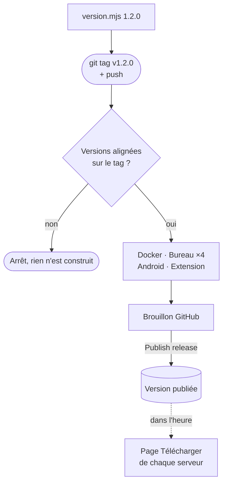

# Guide : publier une version

Une version, c'est un **tag Git** (`v1.2.0`). Le pousser sur GitHub lance le workflow **Release**, qui construit tout sur les machines de GitHub et prépare une release **en brouillon**. Rien n'est visible du public tant que vous ne publiez pas ce brouillon vous-même.

Ce guide suppose que le code est déjà sur GitHub et que la CI est verte. Pour construire à la main sur votre machine, voir [Construire pas à pas](build-guide.md).

## En bref

```bash
node scripts/version.mjs 1.2.0
git add package.json package-lock.json src-tauri/Cargo.toml src-tauri/Cargo.lock src-tauri/tauri.conf.json extension/manifest.json server/src/app.ts
git commit -m "version 1.2.0"
git tag v1.2.0
git push origin main v1.2.0
```

Puis, une fois le workflow terminé : **GitHub → Releases → le brouillon → Edit → Publish release**.

:::mermaid[D'un numéro de version à la page Télécharger]

:::

## 1. Avant de commencer

- [ ] La CI de `main` est verte (onglet **Actions**, workflow **CI**).
- [ ] Les vérifications passent chez vous : `npm run typecheck`, `npm test`, `npm run build`, `npm run build:extension` (liste complète dans [Vérifications avant de publier](build.md#verifications-avant-de-publier)).
- [ ] Les secrets de signature sont en place, si vous voulez un APK Android installable (voir [plus bas](#les-secrets-de-signature)).

!!! tip "Essayer toute la chaîne sans rien publier"
    **Actions → Release → Run workflow**, en laissant **Publier** décoché : tout est construit, et les fichiers sont déposés en artefacts du workflow (gardés 14 jours) au lieu d'une release. C'est la bonne façon de vérifier qu'un changement de dépendance ne casse pas la construction macOS ou Android, sans Mac ni SDK sous la main.

## 2. Choisir le numéro

BetterVault suit le [versionnage sémantique](https://semver.org/lang/fr/) :

| Changement | Exemple | Numéro |
| --- | --- | --- |
| Correction seulement | un bug d'affichage | `1.2.0` → `1.2.1` |
| Nouvelle fonction, compatible | un nouvel import | `1.2.1` → `1.3.0` |
| Changement qui casse quelque chose | ancienne application refusée par le serveur | `1.3.0` → `2.0.0` |

Le numéro figure à huit endroits (serveur, application web, bureau, mobile, extension, et leurs verrous). Le script les change tous :

```bash
node scripts/version.mjs 1.2.0
```

Sans argument, il affiche les versions actuelles et échoue si elles diffèrent :

```bash
node scripts/version.mjs
```

!!! warning "Le numéro de l'extension ne redescend jamais"
    Chrome Web Store et Firefox refusent une mise à jour dont le numéro est inférieur ou égal à celui déjà publié. Si l'extension est plus avancée que le reste, alignez tout sur **son** numéro ou au-dessus.

## 3. Commiter, étiqueter, pousser

```bash
git add package.json package-lock.json src-tauri/Cargo.toml src-tauri/Cargo.lock src-tauri/tauri.conf.json extension/manifest.json server/src/app.ts
git commit -m "version 1.2.0"
git tag v1.2.0
git push origin main v1.2.0
```

Le premier travail du workflow, **Versions alignées sur le tag**, compare le tag aux huit numéros. S'il y a un écart, il s'arrête **avant** de construire : aucune release incohérente (un `v1.2.0` qui contiendrait des installeurs 1.1.0) ne peut sortir.

## 4. Ce que le workflow construit

| Travail | Machine | Fichiers joints au brouillon | Durée (environ) |
| --- | --- | --- | --- |
| Image Docker | Linux | `ghcr.io/<propriétaire>/bettervault:1.2.0`, `:1.2`, `:latest` (amd64 et arm64) | 10 à 20 min |
| Bureau Windows | Windows | `BetterVault_1.2.0_x64-setup.exe`, `…_x64_en-US.msi` | 15 min |
| Bureau macOS | Mac (×2) | `BetterVault_1.2.0_aarch64.dmg`, `BetterVault_1.2.0_x64.dmg` | 15 min chacun |
| Bureau Linux | Ubuntu 22.04 | `.AppImage`, `.deb`, `.rpm` | 15 min |
| Android | Linux | `bettervault-android.apk`, **seulement s'il est signé** | 20 min |
| Extension | Linux | `bettervault-extension-v1.2.0.zip` | 2 min |

Les travaux sont indépendants : si macOS échoue, les autres fichiers sont quand même joints au brouillon. Relancez seulement le travail en échec (**Re-run failed jobs**).

## 5. Publier le brouillon

1. **GitHub → Releases** : le brouillon `BetterVault v1.2.0` apparaît en haut.
2. Vérifiez la liste des fichiers (tableau ci-dessus) et complétez la description : ce qui change pour les utilisateurs, en quelques lignes.
3. **Publish release**.

Ensuite, sans rien faire d'autre :

- la page **Télécharger** de chaque serveur relie ses boutons aux nouveaux fichiers, au plus tard une heure après (voir [Page Télécharger](../deployment/public-page.md#page-telecharger)) ;
- les serveurs qui suivent l'image `:latest` peuvent se mettre à jour (`docker compose pull && docker compose up -d`).

!!! note "Première publication de l'image Docker"
    GitHub crée le paquet `bettervault` en **privé** la première fois. Pour que tout le monde puisse le télécharger : **votre profil → Packages → bettervault → Package settings → Change visibility → Public**. Une seule fois.

## 6. Ce qui reste à la main

| Quoi | Où | Avec quel fichier |
| --- | --- | --- |
| Extension Chrome, Edge | [Chrome Web Store](https://chrome.google.com/webstore/devconsole), [Edge Add-ons](https://partner.microsoft.com/dashboard/microsoftedge) | `bettervault-extension-v1.2.0.zip` |
| Extension Firefox | [addons.mozilla.org](https://addons.mozilla.org/developers/) | le même `.zip` |
| iOS | Xcode, TestFlight | voir [macOS et iOS](../apps/apple.md) |

## Les secrets de signature

Ils se règlent dans **GitHub → Settings → Secrets and variables → Actions → New repository secret**. Tous sont facultatifs : sans eux, la version se construit quand même, avec les limites indiquées.

| Plateforme | Secrets | Sans eux |
| --- | --- | --- |
| Android | `ANDROID_KEYSTORE`, `ANDROID_KEYSTORE_PASSWORD`, `ANDROID_KEY_ALIAS` | **Aucun APK publié** : Android refuse un APK non signé. La page Télécharger marque Android « Bientôt ». |
| macOS | `APPLE_CERTIFICATE`, `APPLE_CERTIFICATE_PASSWORD`, `APPLE_SIGNING_IDENTITY`, `APPLE_ID`, `APPLE_PASSWORD`, `APPLE_TEAM_ID` | Le `.dmg` s'installe, mais macOS l'arrête au premier lancement (clic droit → Ouvrir pour passer outre). |
| Windows | aucun prévu | SmartScreen affiche « Windows a protégé votre ordinateur » tant que le fichier n'a pas de réputation. |

La création de la clé Android est expliquée dans [Construire l'application](build.md#application-android), celle des certificats Apple dans [macOS et iOS](../apps/apple.md).

!!! danger "Une clé de signature ne se remplace pas"
    Android et macOS reconnaissent une application à sa signature. Changer de clé Android oblige chaque utilisateur à désinstaller puis réinstaller l'application. Gardez une sauvegarde de la clé et de son mot de passe hors du dépôt.

## Si ça se passe mal

**Le travail « Versions alignées sur le tag » échoue.** Son journal indique le fichier en retard. Supprimez le tag, corrigez, recommencez :

```bash
git tag -d v1.2.0
git push origin :refs/tags/v1.2.0
node scripts/version.mjs 1.2.0
```

Puis reprenez l'[étape 3](#3-commiter-etiqueter-pousser).

**Un fichier manque dans le brouillon.** Ouvrez le travail correspondant dans **Actions** : l'erreur est dans la dernière étape en rouge. Si l'erreur venait de GitHub (réseau, machine indisponible), **Re-run failed jobs** suffit. Si elle demande une correction du code, supprimez le brouillon et le tag, corrigez sur `main`, puis reprenez à l'[étape 3](#3-commiter-etiqueter-pousser) : un tag désigne un commit précis, il ne suit pas les corrections faites après lui.

**Une version publiée est défectueuse.** Ne la supprimez pas : les serveurs et les téléphones qui l'ont déjà gardent ce numéro. Publiez vite une correction (`1.2.1`). En attendant, marquez-la comme préversion (**Edit → Set as a pre-release**) : GitHub ne la considère plus comme la dernière version, et la page Télécharger revient à la précédente dans l'heure.
